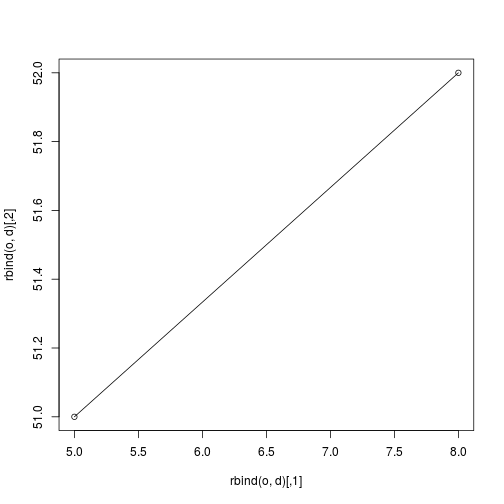
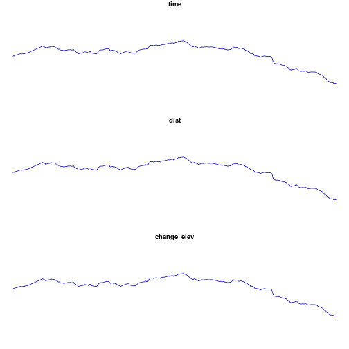
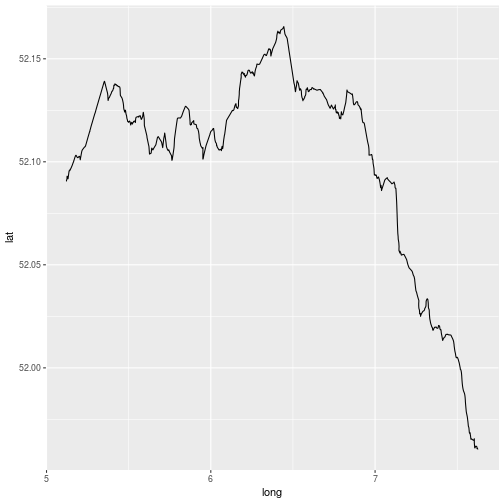
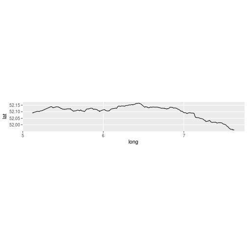
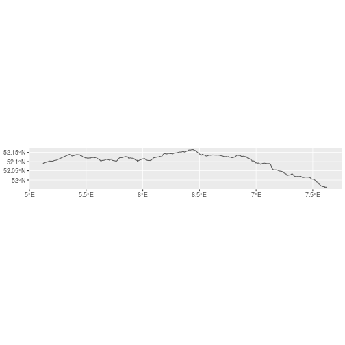
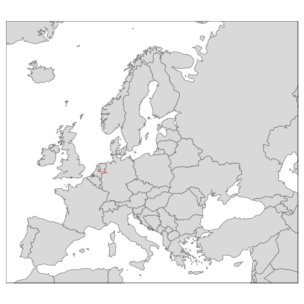
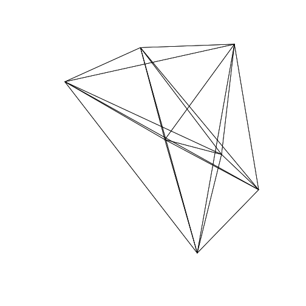
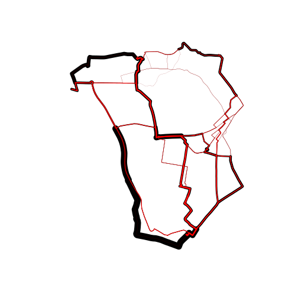
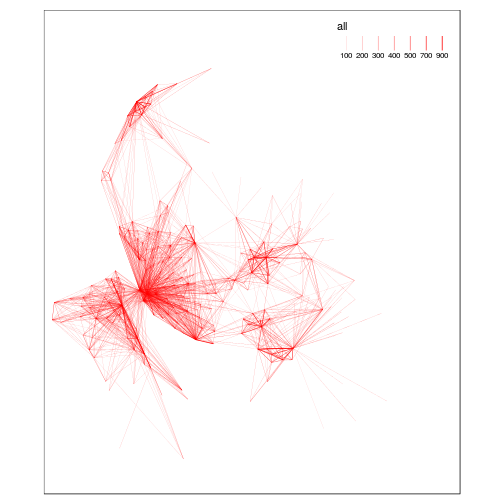

Reproducible workflow for transport planning
How I got here: http://rpubs.com/RobinLovelace/282944

Context - the propensity to cycle tool:
http://rpubs.com/RobinLovelace/278921

Geographic data can save the world: 
http://rpubs.com/RobinLovelace/272796

## Comment on 'tidy' dplyr pipes

See https://csgillespie.github.io/efficientR/data-carpentry.html#chaining-operations


```r
if(!grepl(pattern = "vig", getwd()))
  old = setwd("vignettes")

# How to represent movement on a map?
o = c(5, 51)
d = c(8, 52)

sqrt((o[1] - d[1])^2 + (o[2] - d[2])^2) # what does that mean?
```

```
## [1] 3.162278
```

```r
geosphere::distGeo(o, d)
```

```
## [1] 236143.5
```

```r
plot(rbind(o, d))
lines(rbind(o, d))
```



```r
library(stplanr)
(o = geo_code("Utrecht"))
```

```
##      lon      lat 
##  5.12142 52.09074
```

```r
(d = geo_code("Munster"))
```

```
##       lon       lat 
##  7.626135 51.960665
```

With OSRM


```r
# r_osrm = viaroute(startlat = o[2], startlng = o[1], endlat = d[2], endlng = d[1])
# r_sp = viaroute2sldf(r_osrm)
```

With graphhopper


```r
# r_sp = route_graphhopper(from = o, to = d, vehicle = "bike")
# saveRDS(r_sp, "route-utrecht-munster.Rds")
r_sp = readRDS("route-utrecht-munster.Rds")
r_sf = sf::st_as_sf(r_sp)
```

## Treatment of units


```r
rgeos::gLength(r_sp)
```

```
## Warning in RGEOSMiscFunc(spgeom, byid, "rgeos_length"): Spatial object is
## not projected; GEOS expects planar coordinates
```

```
## [1] 2.697298
```

```r
(d = sf::st_length(r_sf))
```

```
## 200151.5 m
```

```r
units::set_units(d, km)
```

```
## 200.1515 km
```

```r
plot(r_sp)
```


```r
plot(r_sf)
```



```r
devtools::install_github("tidyverse/ggplot2")
```

```
## Skipping install of 'ggplot2' from a github remote, the SHA1 (f1bef79e) has not changed since last install.
##   Use `force = TRUE` to force installation
```

```r
library(ggplot2)

r_fort = fortify(r_sp)
ggplot(r_fort) + geom_path(aes(long, lat))
```



```r
ggplot(r_fort) + geom_path(aes(long, lat)) + coord_map()
```



```r
# with the new sf method
ggplot(r_sf) + geom_sf() # much easier!
```



```r
library(tmap)
r_bb = tmaptools::bb(r_sp, 2)
data("Europe")
qtm(Europe) +
  qtm(r_sp)
```



```r
# try with tmap_mode("view")

# Scaling up the solution to many trips with stplanr
# See the stplanr intro vignette:
# https://cran.r-project.org/web/packages/stplanr/vignettes/introducing-stplanr.html
head(cents)
```

```
## class       : SpatialPointsDataFrame 
## features    : 6 
## extent      : -1.550806, -1.511861, 53.8041, 53.82887  (xmin, xmax, ymin, ymax)
## coord. ref. : +init=epsg:4326 +proj=longlat +datum=WGS84 +no_defs +ellps=WGS84 +towgs84=0,0,0 
## variables   : 4
## names       :  geo_code,  MSOA11NM, percent_fem,  avslope 
## min values  : E02002361, Leeds 032,    0.408759, 2.284782 
## max values  : E02002393, Leeds 064,    0.591141, 5.091685
```

```r
head(flow)
```

```
##        Area.of.residence Area.of.workplace All Work.mainly.at.or.from.home
## 920573         E02002361         E02002361 109                           0
## 920575         E02002361         E02002363  38                           0
## 920578         E02002361         E02002367  10                           0
## 920582         E02002361         E02002371  44                           0
## 920587         E02002361         E02002377  34                           0
## 920591         E02002361         E02002382   7                           0
##        Underground..metro..light.rail..tram Train Bus..minibus.or.coach
## 920573                                    0     0                     4
## 920575                                    0     1                     4
## 920578                                    0     0                     1
## 920582                                    0     0                     2
## 920587                                    0     0                     0
## 920591                                    0     0                     1
##        Taxi Motorcycle..scooter.or.moped Driving.a.car.or.van
## 920573    2                            0                   39
## 920575    1                            0                   24
## 920578    0                            0                    8
## 920582    2                            0                   28
## 920587    1                            2                   19
## 920591    0                            0                    5
##        Passenger.in.a.car.or.van Bicycle On.foot
## 920573                         3       2      59
## 920575                         4       0       4
## 920578                         0       0       1
## 920582                         3       3       6
## 920587                         3       0       9
## 920591                         1       0       0
##        Other.method.of.travel.to.work                  id
## 920573                              0 E02002361 E02002361
## 920575                              0 E02002361 E02002363
## 920578                              0 E02002361 E02002367
## 920582                              0 E02002361 E02002371
## 920587                              0 E02002361 E02002377
## 920591                              0 E02002361 E02002382
```

```r
sum(flow$All)
```

```
## [1] 2816
```

```r
rd = od2line(flow = flow, zones = cents)
plot(rd)
```



```r
# routes_fast = line2route(rd) # needs cyclestreets api key
routes_fast$All = rd$All
rnet = overline(routes_fast, attrib = "All")
plot(rnet, lwd = rnet$All / mean(flow$All))
plot(routes_fast, lwd = routes_fast$All / mean(flow$All), col = "red", add = T)
```



```r
# if this fails, navigate to the following link and download manually:
# https://github.com/npct/pct-data/raw/master/liverpool-city-region/l.Rds
u_pct = "https://github.com/npct/pct-data/raw/master/liverpool-city-region/l.Rds"
if(!exists("l.Rds"))
  download.file(u_pct, "l.Rds")
library(tmap)
library(stplanr) # loads sp

## Loading required package: sp

l = readRDS("l.Rds")
tm_shape(l) + tm_lines(lwd = "all")
```



Exercise
Reproduce this code: http://rpubs.com/RobinLovelace/273513
Output the result


```r
# knitr::spin("munster-code.R", format = "Rmd")
# setwd(old)
```

